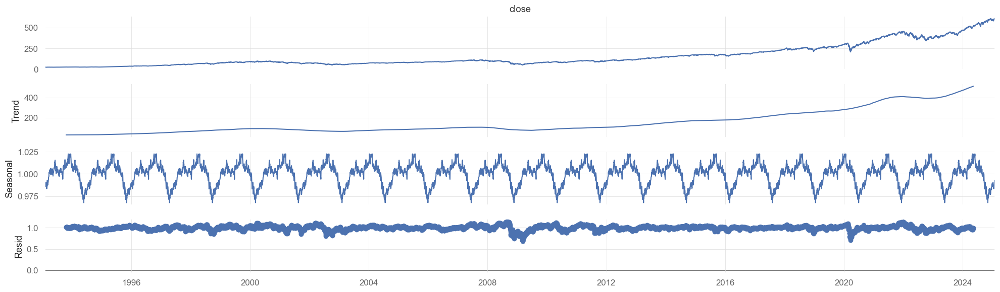

# **S&P 500 Analysis and SPY ETF Correlation**

## **1. Introduction**

### **Objective**
This project aimed to analyze the correlation between the SPY ETF (S&P 500 Tracker) and the stock price movements of various S&P 500 companies. The goal was to assess how each company’s stock price changes correlated with the broader market, investigate seasonal trends, and predict future stock movements using machine learning models.

---

## **2. Data Collection**
### **Data Sources**
- **Yahoo Finance**: Historical stock data for SPY and individual S&P 500 companies was obtained using the `yfinance` Python library. This provided daily stock price data, including **Open**, **High**, **Low**, **Close**, **Volume**, and **Dividends** from 1993 to 2025.
- **Web Scraping**: To gather recent news about top S&P 500 companies, we used web scraping techniques to collect data from sources like Business Insider. The data included headlines, sources, and publication dates related to each company’s stock.
- **S&P 500 Tickers**: We obtained a list of S&P 500 tickers from a CSV file (`sp500_tickers.csv`) containing essential information on each company’s industry and sub-industry.

### **Data Preprocessing**
- **Handling Missing Values**: Missing data points were cleaned by removing rows with NaN values or applying forward/backward filling where appropriate.
- **Feature Engineering**:
  - **Percentage Changes**: New columns such as `pct_change`, `pct_open_close`, and `pct_close_open` were calculated to understand price movements.
  - **Categorical Encoding**: Days of the week and months were one-hot encoded to be used as features for machine learning models.
  - **Time Features**: Created additional features such as **Weekday**, **Month**, **Quarter**, and **Year** to analyze trends and seasonality in the data.

---

## **3. Exploratory Data Analysis (EDA)**
### **Visualizations**
- **Correlation Matrices**: A heatmap was generated to visualize the correlation between various features, including the correlation of S&P 500 companies’ stock movements with the SPY ETF.
- **Seasonal Decomposition**: The SPY closing prices were decomposed into trend, seasonal, and residual components to understand long-term trends, periodic fluctuations, and noise in the data.
- **Percentage Change by Weekday/Month**: Bar plots and line charts were created to analyze how stock price changes vary across different days of the week and months of the year.
- **Volume vs Percentage Change**: Scatter plots were used to analyze the relationship between trade volume and percentage changes in stock prices, showing that volume didn’t significantly impact price changes.

### **Key Insights**

- **Trend**: The SPY ETF exhibited a clear long-term upward trend, reflecting the general growth of the U.S. economy over the past few decades.
- **Seasonality**: Certain months, such as November, showed stronger performance, likely due to market cycles and holiday-related effects like the "Santa Rally."
- **Weekday Effects**: Analysis revealed that Tuesdays showed stronger performance than other weekdays, which could be tied to market news or other timing factors.

---

## **4. Modeling and Forecasting**
### **Machine Learning Models**
- **Decision Tree Classifier**: A decision tree was trained to predict whether the stock price would go up or down based on historical data. The model achieved an accuracy of **44%** on test data, indicating the need for more complex models.
- **LSTM Neural Network**: A Long Short-Term Memory (LSTM) model was implemented for time series forecasting to predict future trends in SPY. This deep learning approach yielded better results than traditional machine learning models.

### **Model Evaluation**
- **Accuracy**: The LSTM model demonstrated a performance accuracy of around **0.77** for classifying trends.
- **Confusion Matrix**: The confusion matrix was used to evaluate the model’s performance by comparing the predicted values against actual values, helping identify areas for improvement.

---

## **5. Statistical Testing and Results**
### **Augmented Dickey-Fuller (ADF) Test**
The ADF test was performed on the SPY ETF’s percentage change (`pct_change`) and residuals from the seasonal decomposition. The p-value of the test was **0.5897**, indicating that the series was non-stationary, which required further differencing or transformation to make the data suitable for forecasting models.

### **Next Steps**
To handle non-stationary data:
- **Differencing**: Applied first and second differences to remove trends and achieve stationarity.
- **Seasonal Differencing**: Used to adjust for seasonal patterns in the data and enhance model stability.

---

## **6. Conclusion**
### **Key Findings**
- **Positive Trend**: The SPY ETF’s historical data showed a persistent upward trend, suggesting long-term investment profitability.
- **Seasonality**: The stock market exhibited noticeable seasonal trends, especially during certain months like November, providing valuable insights for timing investments.
- **Predictive Models**: While machine learning models like Decision Trees and LSTMs provided useful insights, further optimization is necessary to improve predictive accuracy.

### **Challenges and Limitations**
- **Non-Normal Residuals**: The residuals of the models did not follow a normal distribution, indicating that some model complexities might have been overlooked.
- **Volatility Modeling**: Given the presence of heteroskedasticity (volatility clustering), future models could benefit from volatility modeling techniques such as GARCH to account for varying market volatility.

---

## **7. Skills Demonstrated**
Throughout the project, I demonstrated a wide range of skills:
- **Data Collection and Preprocessing**: Leveraged libraries like `yfinance` for data scraping, `pandas` for data manipulation, and `BeautifulSoup` for web scraping to gather real-time news data.
- **Feature Engineering**: Created new features like percentage changes, one-hot encoded days of the week, and seasonal decomposition for better analysis.
- **Exploratory Data Analysis**: Performed in-depth analysis with visualization libraries such as `matplotlib` and `seaborn` to uncover insights in the data.
- **Machine Learning**: Applied decision tree classification and LSTM models to predict stock movements and trends, utilizing `scikit-learn` and `tensorflow` for model training and evaluation.
- **Statistical Testing**: Used statistical tests like the Augmented Dickey-Fuller (ADF) test to ensure that the data was suitable for modeling, applying time series transformations to improve model accuracy.

